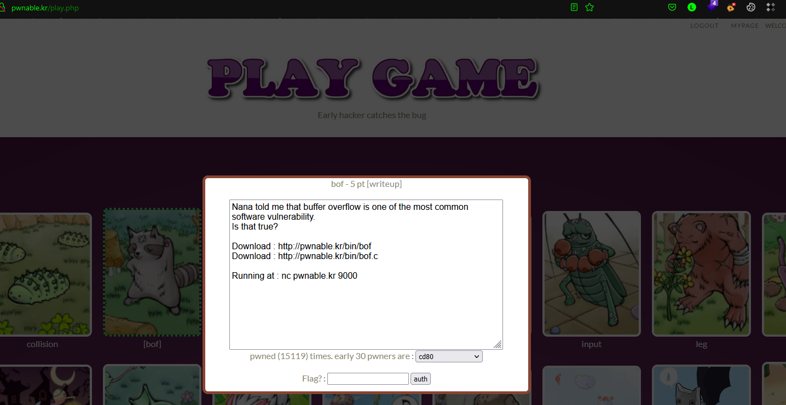

# [pwnable.kr](http://pwnable.kr/play.php) - bof Challenge



## 1.1 Getting resource
```sh
$ wget http://pwnable.kr/bin/bof && wget http://pwnable.kr/bin/bof.c
```
```bash
th3knight$wget http://pwnable.kr/bin/bof && wget http://pwnable.kr/bin/bof.c
--2022-01-09 17:45:49--  http://pwnable.kr/bin/bof
Resolving pwnable.kr (pwnable.kr)... 128.61.240.205
Connecting to pwnable.kr (pwnable.kr)|128.61.240.205|:80... connected.
HTTP request sent, awaiting response... 200 OK
Length: 7348 (7,2K)
Saving to: ‘bof.2’

bof.2                         100%[=================================================>]   7,18K  --.-KB/s    in 0s

2022-01-09 17:45:50 (526 MB/s) - ‘bof.2’ saved [7348/7348]

--2022-01-09 17:45:50--  http://pwnable.kr/bin/bof.c
Resolving pwnable.kr (pwnable.kr)... 128.61.240.205
Connecting to pwnable.kr (pwnable.kr)|128.61.240.205|:80... connected.
HTTP request sent, awaiting response... 200 OK
Length: 308 [text/x-csrc]
Saving to: ‘bof.c.2’

bof.c.2                       100%[=================================================>]     308  --.-KB/s    in 0s

2022-01-09 17:45:50 (18,1 MB/s) - ‘bof.c.2’ saved [308/308]
```
Compile the program to make a link on it and determine if needed
```sh
$ gcc -m32 -g bof.c -o bof1
```
```bash
th3knight$gcc -m32 -g bof.c -o bof1
bof.c: In function ‘func’:
bof.c:7:2: warning: implicit declaration of function ‘gets’; did you mean ‘fgets’? [-Wimplicit-function-declaration]
    7 |  gets(overflowme); // smash me!
      |  ^~~~
      |  fgets
/usr/bin/ld: /tmp/cc2lH4R6.o: in function `func':
/home/th3knight/Desktop/learning/shellcoding/pwnable.kr/bof/bof.c:7: warning: the `gets' function is dangerous and should not be used.
```
This will have the warn when using the risk function, don't worry about it!

## 1.2 Overflowing the program
### 1.2.1 Reading and analysis the source code
First up, we need to see what is in the code
```bash
$ cat bof.c
```
```c
#include <string.h>
#include <stdlib.h>
void func(int key){
        char overflowme[32];
        printf("overflow me : ");
        gets(overflowme);       // smash me!
        if(key == 0xcafebabe){
                system("/bin/sh");
        }
        else{
                printf("Nah..\n");
        }
}
int main(int argc, char* argv[]){
        func(0xdeadbeef);
        return 0;
}
```
We see that, in the main function inputted is `0xdeadbeef`
```c
int main(int argc, char* argv[]){
        func(0xdeadbeef); // <=== Here
        return 0;
}
```

and in `func()`, there is an array with `char overflowme[32]` and have a risk function called from lib is `gets()` with the note: smash me!
```c
void func(int key){
        char overflowme[32];
        printf("overflow me : ");
        gets(overflowme);       // smash me!
```
and if the key (which is 0xdeadbeef) is 0xcafebabe, there would be system call the `sh` binary
```c
if(key == 0xcafebabe){
	system("/bin/sh");
}
```
### 1.2.2 Debugging program and find the length to overflow & override the key.
In here i will use the gdb debugger to the bug the program
```bash
th3knight$gdb -q bof
Reading symbols from bof...
(No debugging symbols found in bof)
gdb-peda$
```
In here, the output of mine might different than yours because i've already installed the [Peda](https://github.com/longld/peda)
Let's disassembly the main
```powershell
gdb-peda$ disas main

Dump of assembler code for function main:
   0x5655568a <+0>:     push   ebp
   0x5655568b <+1>:     mov    ebp,esp
   0x5655568d <+3>:     and    esp,0xfffffff0
   0x56555690 <+6>:     sub    esp,0x10
   0x56555693 <+9>:     mov    DWORD PTR [esp],0xdeadbeef
   0x5655569a <+16>:    call   0x5655562c <func>
   0x5655569f <+21>:    mov    eax,0x0
   0x565556a4 <+26>:    leave
   0x565556a5 <+27>:    ret
End of assembler dump.
```
In here, we could see in the address `0x56555693` : `0xdeadbeef` moved into pointer of ESP and then `call <func>`, let's disassembly the function `func` to see other intructions.
```powershell
gdb-peda$ disas func

Dump of assembler code for function func:
   0x5655562c <+0>:     push   ebp
   0x5655562d <+1>:     mov    ebp,esp
   0x5655562f <+3>:     sub    esp,0x48
   0x56555632 <+6>:     mov    eax,gs:0x14
   0x56555638 <+12>:    mov    DWORD PTR [ebp-0xc],eax
   0x5655563b <+15>:    xor    eax,eax
   0x5655563d <+17>:    mov    DWORD PTR [esp],0x78c
   0x56555644 <+24>:    call   0x56555645 <func+25>
   0x56555649 <+29>:    lea    eax,[ebp-0x2c]
   0x5655564c <+32>:    mov    DWORD PTR [esp],eax
   0x5655564f <+35>:    call   0x56555650 <func+36>
   0x56555654 <+40>:    cmp    DWORD PTR [ebp+0x8],0xcafebabe
   0x5655565b <+47>:    jne    0x5655566b <func+63>
   0x5655565d <+49>:    mov    DWORD PTR [esp],0x79b
   0x56555664 <+56>:    call   0x56555665 <func+57>
   0x56555669 <+61>:    jmp    0x56555677 <func+75>
   0x5655566b <+63>:    mov    DWORD PTR [esp],0x7a3
   0x56555672 <+70>:    call   0x56555673 <func+71>
   0x56555677 <+75>:    mov    eax,DWORD PTR [ebp-0xc]
   0x5655567a <+78>:    xor    eax,DWORD PTR gs:0x14
   0x56555681 <+85>:    je     0x56555688 <func+92>
   0x56555683 <+87>:    call   0x56555684 <func+88>
   0x56555688 <+92>:    leave
   0x56555689 <+93>:    ret
End of assembler dump.
```
